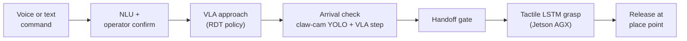
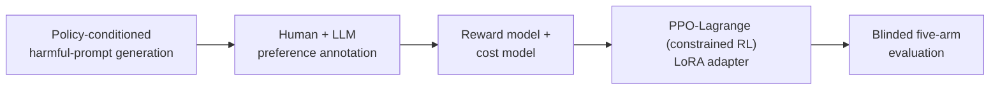

  

National University of Kaohsiung · cmwang16@gmail.com · [繁體中文](README.zh-TW.md)

## Vision-Language-Action (VLA) robot learning

A voice-commanded pick-and-place system on two machines. A spoken or typed instruction selects the object.
An RDT (Robotics Diffusion Transformer) Vision-Language-Action policy, conditioned on two RealSense views,
a claw camera and the instruction, moves the arm over the object. At grasp height the arm hands off to a
tactile LSTM on a Jetson AGX that closes and releases the fingers.

What the VLA work found and built:

- The policy first collapsed to the dataset-mean pose whatever the cameras showed. Zeroing the
  proprioceptive state token ("blind-state" training, with the same setting at deployment) forces it to
  localize from vision.
- The arm descends only when two checks agree: the claw-camera YOLO box sits on a per-object setpoint, and
  the VLA's predicted next step is small. The check runs at hover height only, because below about 200 mm
  the object is under the fingers and YOLO degrades.
- The laptop commands the arm and the AGX commands the fingers, so neither machine controls both. The
  finger models are preloaded during the approach, which removes the loading lag at the handoff.
- Browser speech recognition is open-vocabulary and ranks short words poorly (a bare "knife" came back as
  "OK Google"). The client forwards every alternative, and the server picks the first one that names a known
  object, with a homophone pass as fallback.
- In the current demo each object runs at a different rung of a fallback ladder: the trapezoid uses the VLA
  approach, the board a side-camera locator, and the butter knife a recorded pick position.

| Project | What it is |
|---|---|
| [voice-pick-vla](https://github.com/bubbleee030/voice-pick-vla) | The full system: RDT VLA policy, YOLO and tactile pipelines, voice interface, web dashboard and design records. |
| [VLA](https://github.com/bubbleee030/VLA) | The earlier work: RDT fine-tuning on a self-collected pick dataset, GelSight tactile-image augmentation and tactile-vs-baseline experiments. |

  
   voice-pick-vla operator dashboard. Two RealSense views, claw camera with YOLO, live tactile trace, arm state and voice input.

## Safe reinforcement learning for LLMs

Safe RL for an 8B Traditional Chinese customer-service model. A LoRA policy is trained with PPO-Lagrange,
a constrained RL method: it maximizes a learned reward model (helpfulness) while keeping a learned cost
model (safety) under a threshold, and a Lagrange multiplier sets how hard the constraint pushes. Prompts
come from a policy-conditioned red-team generator, and a blinded evaluation judges the result.

What the RL work found:

- The first PPO-Lagrange run was indistinguishable from the untrained model. Four defects, each measurable
  before training, kept the constraint from acting: a leaky cost-model split (true recall of unsafe
  responses was 20.1%), a cost threshold of 0.0 that every batch already met (the multiplier decayed to
  0.0114), a reward model that scored unsafe compliance 2.121 above a safe refusal, and an unstable actor
  learning rate.
- The multiplier follows the threshold. It decays when the threshold is always met, saturates at its cap
  when it is never met, and adapts only when the threshold is reachable and reached.

RL design choices

- The objective is to maximize the reward model's score while the cost model's score stays under a threshold. The implementation is ported from PKU-Alignment's safe-rlhf. The actor's advantage combines both: `(A_reward − λ · A_cost) / (1 + λ)`, with a per-token KL penalty to the reference policy.
- The multiplier λ is learned in log space by SGD on the windowed mean episode cost, with a cap.
- The reward and cost models, on a Ministral-3-3B backbone, are frozen scorers. The actor is a LoRA adapter on the 8B base, and a reward critic and a cost critic initialized from the two models are trained with it.
- Gate-and-rank came first: at inference time the cost model rejects unsafe candidates and the reward model ranks the rest. An early reward model had about 0.60 by-prompt accuracy, which invites reward hacking under PPO, whereas in gate-and-rank a weak reward model can only mis-rank candidates that are already safe.

| Project | What it is | One finding |
|---|---|---|
| [RLHF_Customer](https://github.com/bubbleee030/RLHF_Customer) | Reward/cost models and PPO-Lagrange for safety, with a preregistered held-out set | Adapter on top of a system prompt: **+24.5 pp** safe outcomes, 95% CI [13.7, 36.3] (163 prompts). Replacing the prompt with the adapter: inconclusive. |
| [airflow-datagen-harmful-prompt](https://github.com/bubbleee030/airflow-datagen-harmful-prompt) | Turns a written safety policy into severity-graded red-team prompts with provenance | Against 50 blind human labels, an untuned `gpt-oss-20b` judge caught **0.91** of violations. The safety-tuned 120B model caught 0.68–0.70. |
| [sft_project](https://github.com/bubbleee030/sft_project) | Data pipeline for a Traditional Chinese LLM-as-a-Judge: SimHash dedup, Traditional/Simplified filtering, ablations | In one run only **43.8%** of raw judge records were usable. 32.5% were near-duplicates, 23.7% malformed. |
| [argilla_project](https://github.com/bubbleee030/argilla_project) | Pairwise-preference annotation platform with automatic backup | Annotation exports are converted into DPO pairs and judge test sets in `sft_project`. |

<table>
  <tr>
    <td width="50%" align="center" valign="top">
      
       RLHF_Customer. Paired effects with 95% intervals. Intervals that cross zero are marked inconclusive.
    </td>
    <td width="50%" align="center" valign="top">
      
       sft_project. Fewer than half of the raw records were usable.
    </td>
  </tr>
</table>

  
   RLHF_Customer: terminal Lagrange multiplier for each run, against its cap.

## Also

- [Peek](https://github.com/bubbleee030/Peek): a macOS menu-bar app that lists what is inside folders and archives when you press space in Finder (Swift, with a downloadable release).
- [Caffeine](https://github.com/bubbleee030/Caffeine): a fork that adds lid-closed mode, launch at login and Traditional Chinese localization.

## Tools I work with

Python · PyTorch · Hugging Face · LLaMA-Factory · Airflow · Docker · Slurm / Singularity ·
Swift / SwiftUI · TypeScript · Flask / Socket.IO · RealSense · YOLO · Jetson
