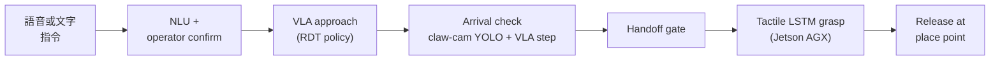
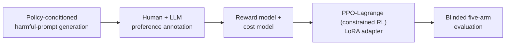

  

國立高雄大學 · cmwang16@gmail.com · [English](README.md)

## Vision-Language-Action (VLA) robot learning

語音控制的 pick-and-place 系統,跨兩台機器。語音或文字指令選定物體,RDT(Robotics Diffusion Transformer)Vision-Language-Action policy 以兩個 RealSense 視角、claw camera 與指令為 conditioning,把手臂移到物體上方。到達 grasp 高度後,控制權交給 Jetson AGX 上的 tactile LSTM,由它閉合與釋放夾爪。

VLA 部分的發現與實作:

- Policy 一開始會 collapse 到 dataset 的平均姿態,不管相機看到什麼。把 proprioceptive state token 歸零("blind-state" training,deployment 也用同樣設定),才迫使它從視覺定位。
- 手臂只在兩個檢查一致時才下降:claw camera 的 YOLO box 落在每個物體的 setpoint 上,而且 VLA 預測的下一步位移很小。檢查只在 hover 高度進行,因為低於約 200 mm 時物體在夾爪之下,YOLO 會退化。
- 手臂由 laptop 控制,夾爪由 AGX 控制,兩台機器不會同時控制同一個部位。夾爪的模型在 approach 期間就先 preload,消除 handoff 時的載入延遲。
- 瀏覽器的語音辨識是 open-vocabulary,對很短的詞排序不佳("knife" 曾被辨識成 "OK Google")。Client 把所有 alternatives 都送出,server 選第一個命中已知物體的,找不到時再做 homophone 比對。
- 目前的 demo 中,每個物體走 fallback ladder 的不同層級:梯形用 VLA approach,電路板用 side-camera locator,奶油刀用記錄的取物位置。

| 專案 | 內容 |
|---|---|
| [voice-pick-vla](https://github.com/bubbleee030/voice-pick-vla) | 完整系統:RDT VLA policy、YOLO 與 tactile pipeline、語音介面、網頁 dashboard 與設計紀錄。 |
| [VLA](https://github.com/bubbleee030/VLA) | 較早期的工作:在自行收集的 pick dataset 上做 RDT fine-tuning、GelSight tactile image augmentation、tactile vs baseline 實驗。 |

  
   voice-pick-vla operator dashboard:兩個 RealSense 視角、claw camera 與 YOLO、即時 tactile 曲線、手臂狀態與語音輸入。

## Safe reinforcement learning for LLMs

8B 繁體中文客服模型的 safe RL。以 PPO-Lagrange(constrained RL)訓練 LoRA policy:在 cost model(safety)低於 threshold 的限制下,最大化 reward model(helpfulness),並由 Lagrange multiplier 決定 constraint 的力道。Prompts 來自 policy-conditioned 的 red-team generator,最後用 blinded evaluation 檢驗成果。

RL 部分的發現:

- 第一次 PPO-Lagrange 訓練和未訓練模型無法區分。四個訓練前就能量測的缺陷讓 constraint 發揮不了作用:cost model 的 split 洩漏(對 unsafe responses 的真實 recall 只有 20.1%)、cost threshold 設為 0.0 而每個 batch 都已達標(multiplier 衰減到 0.0114)、reward model 給 unsafe compliance 的分數比 safe refusal 高 2.121,以及不穩定的 actor learning rate。
- Multiplier 的行為由 threshold 決定:threshold 總是達標時衰減,從未達標時撞到 cap,只有在 threshold 可達且確實達到時才會調整。

RL design choices

- 目標是在 cost model 的分數低於 threshold 的前提下,最大化 reward model 的分數,實作移植自 PKU-Alignment 的 safe-rlhf。Actor 的 advantage 同時結合兩者:`(A_reward − λ · A_cost) / (1 + λ)`,並加上對 reference policy 的 per-token KL penalty。
- Multiplier λ 在 log space 中以 SGD 學習,更新依據是 windowed 的平均 episode cost,並設有 cap。
- Reward model 與 cost model(Ministral-3-3B backbone)是 frozen scorers。Actor 是 8B base 上的 LoRA adapter,另有從這兩個模型初始化的 reward critic 與 cost critic 一起訓練。
- 先做 gate-and-rank:inference 時由 cost model 拒絕 unsafe candidates,再由 reward model 排序其餘結果。早期的 reward model by-prompt accuracy 約 0.60,在 PPO 下容易引發 reward hacking;在 gate-and-rank 中,弱的 reward model 只會排錯本來就安全的 candidates。

| 專案 | 內容 | 一個發現 |
|---|---|---|
| [RLHF_Customer](https://github.com/bubbleee030/RLHF_Customer) | reward / cost model 與 PPO-Lagrange 安全訓練,附 preregistered held-out set | 在 system prompt 之上加 adapter:safe outcome **+24.5 pp**,95% CI [13.7, 36.3](163 筆 prompts)。用 adapter 取代 system prompt:無法下結論。 |
| [airflow-datagen-harmful-prompt](https://github.com/bubbleee030/airflow-datagen-harmful-prompt) | 把書面 safety policy 轉成附 provenance、分 severity 的 red-team prompts | 對照 50 筆 blind 人工標籤,未微調的 `gpt-oss-20b` judge 抓到 **0.91** 的違規;safety-tuned 的 120B 只抓到 0.68–0.70。 |
| [sft_project](https://github.com/bubbleee030/sft_project) | 繁中 LLM-as-a-Judge 的資料 pipeline:SimHash dedup、繁簡過濾、ablation | 某次執行中,原始 judge 紀錄只有 **43.8%** 可用;32.5% 是 near-duplicate,23.7% 格式錯誤。 |
| [argilla_project](https://github.com/bubbleee030/argilla_project) | pairwise preference 標註平台,含自動備份 | 標註匯出會在 `sft_project` 中轉成 DPO pairs 與 judge test set。 |

<table>
  <tr>
    <td width="50%" align="center" valign="top">
      
       RLHF_Customer:paired effect 與 95% 區間。跨過 0 的區間標為 inconclusive。
    </td>
    <td width="50%" align="center" valign="top">
      
       sft_project:可用的原始紀錄不到一半。
    </td>
  </tr>
</table>

  
   RLHF_Customer:各 run 的 terminal Lagrange multiplier 與其 cap。

## 其他

- [Peek](https://github.com/bubbleee030/Peek):macOS menu-bar App,在 Finder 按空白鍵就能看到資料夾與壓縮檔裡有什麼(Swift,附 release)。
- [Caffeine](https://github.com/bubbleee030/Caffeine):fork,新增闔蓋模式、登入時啟動與繁中 localization。
