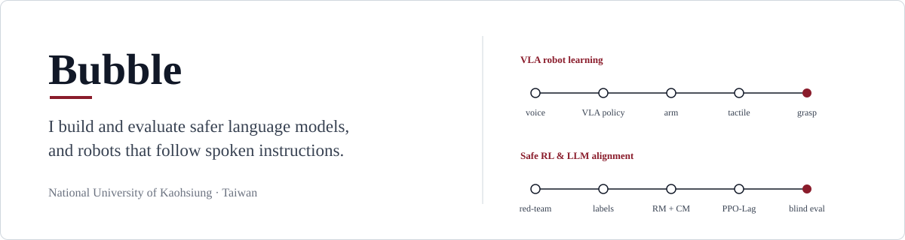

  

國立高雄大學 · cmwang16@gmail.com · [English](README.md)

## LLM safety and alignment

8B 繁體中文客服模型的 safety alignment:red-team prompts 生成、reward model 與 cost model 訓練、PPO-Lagrange,最後用 blinded evaluation 檢驗成果。

| 專案 | 內容 | 一個發現 |
|---|---|---|
| [RLHF_Customer](https://github.com/bubbleee030/RLHF_Customer) | reward / cost model 與 PPO-Lagrange 安全訓練,附 preregistered held-out set | 在 system prompt 之上加 adapter:safe outcome **+24.5 pp**,95% CI [13.7, 36.3](163 筆 prompts)。用 adapter 取代 system prompt:無法下結論。 |
| [airflow-datagen-harmful-prompt](https://github.com/bubbleee030/airflow-datagen-harmful-prompt) | 把書面 safety policy 轉成附 provenance、分 severity 的 red-team prompts | 對照 50 筆 blind 人工標籤,未微調的 `gpt-oss-20b` judge 抓到 **0.91** 的違規;safety-tuned 的 120B 只抓到 0.68–0.70。 |
| [sft_project](https://github.com/bubbleee030/sft_project) | 繁中 LLM-as-a-Judge 的資料 pipeline:SimHash dedup、繁簡過濾、ablation | 某次執行中,原始 judge 紀錄只有 **43.8%** 可用;32.5% 是 near-duplicate,23.7% 格式錯誤。 |
| [argilla_project](https://github.com/bubbleee030/argilla_project) | pairwise preference 標註平台,含自動備份 | 標註匯出會在 `sft_project` 中轉成 DPO pairs 與 judge test set。 |

<table>
  <tr>
    <td width="50%" align="center" valign="top">
      
       RLHF_Customer:paired effect 與 95% 區間。跨過 0 的區間標為 inconclusive。
    </td>
    <td width="50%" align="center" valign="top">
      
       sft_project:可用的原始紀錄不到一半。
    </td>
  </tr>
</table>

## Robot learning

| 專案 | 內容 |
|---|---|
| [voice-pick-vla](https://github.com/bubbleee030/voice-pick-vla) | 語音控制的 pick-and-place 系統,跨兩台機器:RDT VLA policy 控制手臂,Jetson AGX 上的 tactile LSTM 控制夾爪。含 fallback ladder 與網頁 dashboard。 |
| [VLA](https://github.com/bubbleee030/VLA) | 較早期的工作:RDT fine-tuning、資料轉換、tactile image augmentation、tactile vs baseline 實驗。 |

  
   voice-pick-vla operator dashboard:兩個 RealSense 視角、claw camera 與 YOLO、即時 tactile 曲線、手臂狀態與語音輸入。

## 其他

- [Peek](https://github.com/bubbleee030/Peek):macOS menu-bar App,在 Finder 按空白鍵就能看到資料夾與壓縮檔裡有什麼(Swift,附 release)。
- [Caffeine](https://github.com/bubbleee030/Caffeine):fork,新增闔蓋模式、登入時啟動與繁中 localization。
